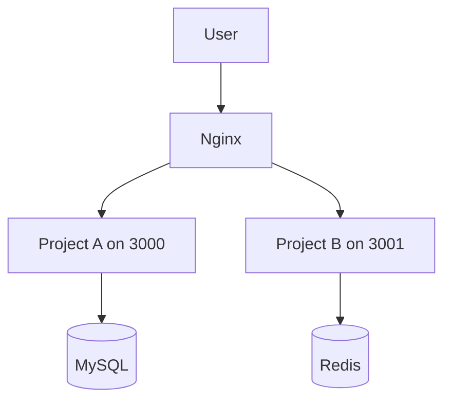

# Sample Server Deployment Review Report

This is a simplified example showing what a completed staged review may look like.

## Phase 1: Server Discovery Summary

| Area | Finding |
|---|---|
| OS | Ubuntu Linux |
| Web server | Nginx detected |
| Process manager | PM2 detected |
| Docker | Not used for current app services |
| Database | MySQL detected |
| Cache | Redis detected |
| Occupied ports | 80, 443, 3000, 3001 |

## Phase 2: Architecture Summary



## Phase 3: Risk Summary

| Risk category | Level | Reason | Mitigation |
|---|---|---|---|
| Port | Medium | Several common Node ports are already used | Use a new confirmed port such as 3010 |
| Nginx | Medium | Existing reverse proxy config is active | Add a separate config file for the new project |
| Database | Medium | MySQL is shared | Use a separate database or schema |
| Environment variables | Low | Project-level env files are possible | Use a dedicated `.env` file |

## Phase 4: Change Impact Summary

| Resource | Current user | Proposed new usage | Affected? | Risk level |
|---|---|---|---|---|
| Nginx | Existing projects | Add new site config | Yes | Medium |
| Port 3010 | None detected | New project app port | No | Low |
| MySQL | Project A | Possible new database | Yes | Medium |
| PM2 | Existing Node apps | Add new process | Yes | Low |

Isolation classification:

```text
Partially shared resources
```

## Phase 5: Deployment Plan Summary

| Item | Proposed value |
|---|---|
| Project directory | `/var/www/my-new-project` |
| Port | `3010` |
| PM2 name | `my-new-project` |
| Environment file | `/var/www/my-new-project/.env` |
| Nginx config | `/etc/nginx/sites-available/my-new-project.conf` |
| Database strategy | Independent database preferred |

## Phase 6: Rollback Summary

Rollback triggers:

- New app process fails to start
- Nginx validation fails
- Existing service becomes unreachable
- New domain returns an error

Rollback steps:

1. Stop only the new project process.
2. Remove or disable only the new Nginx site config.
3. Restore previous Nginx state.
4. Verify existing projects are still reachable.
5. Confirm CPU, memory, disk, and logs are normal.

## Phase 7: Gate

Deployment must not start until the user says:

```text
Start deployment
```
