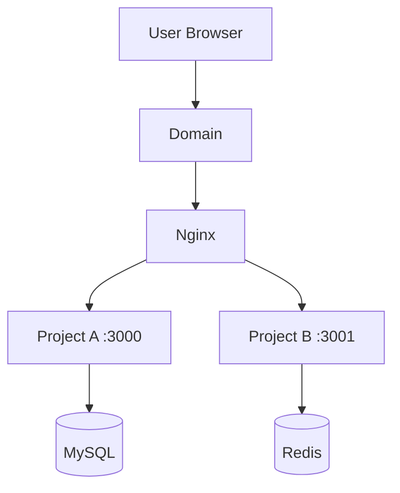

# Phase 2: Architecture Analysis

## Goal

Build a clear architecture view of the existing server based on the Phase 1 discovery report.

This phase should not run additional modification commands.

Phase 2 is an architecture understanding phase, not a deployment planning phase.

## Input required

Use the completed Phase 1 report, including:

- Running services
- Open ports
- Nginx configuration
- PM2 processes
- Docker containers
- Database and cache services
- Project directories
- Human-redacted sensitive discovery summaries, if provided

## Restrictions

You must not:

- Modify files
- Create files or directories
- Delete files
- Restart services
- Stop services
- Install software
- Change Nginx, PM2, Docker, database, or environment variables
- Enter risk analysis
- Enter deployment planning

## Output discipline

Do not skip required output sections.

If information is unavailable, write `Unknown` instead of omitting the section.

For every key architecture judgment, include evidence or source references from the Phase 1 discovery report, terminal output, or human-redacted summaries.

Use confidence levels to distinguish confirmed facts from reasonable assumptions.

Recommended confidence values:

- High: directly supported by command output or human-redacted configuration summary
- Medium: strongly inferred from multiple pieces of evidence
- Low: plausible but weakly supported
- Unknown: not enough information

## Analysis tasks

### 1. Identify current server components

Classify detected components into:

- Entry layer: domain, DNS assumption, Nginx, HTTPS if visible
- Application layer: Node.js apps, Python apps, Docker apps, static sites, unknown apps
- Process management layer: PM2, Docker, systemd, manual processes
- Data layer: MySQL, MariaDB, PostgreSQL, Redis, external databases
- Storage layer: upload directories, log directories, application directories if visible

### 2. Map traffic flow

Explain how requests likely flow through the system.

Example:

```text
User request -> Domain -> Nginx -> Local port -> Application process -> Database/cache
```

Important:

Distinguish between the reverse proxy target address and the service listening address.

For example:

```text
Nginx proxy_pass target: http://127.0.0.1:5000
Actual service listening address: *:5000 or 0.0.0.0:5000
```

Do not treat these as the same thing.

This distinction is important because a service listening on `*:5000` may have a different exposure profile from a service listening only on `127.0.0.1:5000`.

### 3. Draw architecture diagram

Use Mermaid.

Example:



The diagram should reflect both:

- Public entry points
- Internal upstream or local proxy targets

If the actual service listening address is different from the reverse proxy target, show or describe that difference clearly.

### 4. Identify existing project and service map

Create a structured map of detected services and projects.

Include:

- Service or project name
- Path
- Port
- Runtime or process manager
- Domain
- Data dependency
- Confidence
- Evidence

### 5. Identify unknowns

Clearly list uncertain items, such as:

- Unknown project owner
- Unknown port purpose
- Unknown database mapping
- Unknown environment variable dependency
- Unknown deployment method
- Unknown Nginx configuration file location
- Unknown firewall or cloud security group behavior
- Unknown HTTPS redirect behavior

### 6. Optional preliminary architecture recommendation for the new project

If the user has already provided a target new project, domain, or runtime, you may include a preliminary architecture recommendation.

If included, the section must be titled exactly:

```markdown
## Preliminary Architecture Recommendation for New Project
```

This section must clearly state:

```text
This is only a Phase 2 architecture-level preliminary recommendation. It is not the final deployment plan. The final isolated deployment plan belongs to Phase 5.
```

Do not present a preliminary recommendation as the final deployment scheme.

## Required output format

```markdown
# Phase 2: Architecture Analysis Report

## 1. Server component classification

| Layer | Component | Evidence | Notes |
|---|---|---|---|

## 2. Current traffic flow

## 3. Mermaid architecture diagram

## 4. Existing project/service map

| Service/project | Path | Port | Runtime/process manager | Domain | Data dependency | Confidence | Evidence |
|---|---|---|---|---|---|---|---|

## 5. Unknowns and assumptions

## 6. Architecture observations

## Preliminary Architecture Recommendation for New Project

Only include this section if the user has already provided enough new-project context.

State clearly that this is not the final deployment plan and that Phase 5 owns the final isolated deployment plan.

Phase 2 completed. Waiting for user confirmation before moving to the next phase.
```

## Stop condition

After completing this report, stop.

Do not proceed to risk analysis until the user says:

```text
Continue to next phase
```
