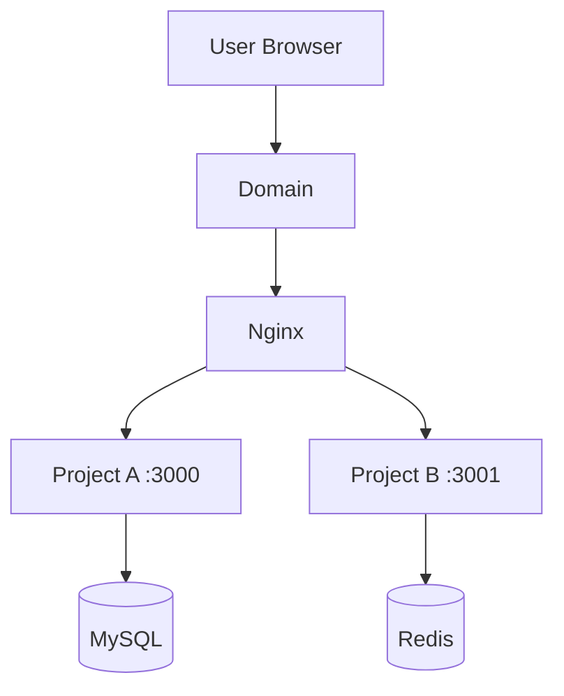

# Phase 2: Architecture Analysis

## Goal

Build a clear architecture view of the existing server based on the Phase 1 discovery report.

This phase should not run additional modification commands.

## Input required

Use the completed Phase 1 report, including:

- Running services
- Open ports
- Nginx configuration
- PM2 processes
- Docker containers
- Database and cache services
- Project directories

## Restrictions

You must not:

- Modify files
- Create files or directories
- Delete files
- Restart services
- Stop services
- Install software
- Change Nginx, PM2, Docker, database, or environment variables

## Analysis tasks

### 1. Identify current server components

Classify detected components into:

- Entry layer: domain, DNS assumption, Nginx, HTTPS if visible
- Application layer: Node.js apps, Python apps, Docker apps, static sites, unknown apps
- Process management layer: PM2, Docker, systemd, manual processes
- Data layer: MySQL, MariaDB, PostgreSQL, Redis, external databases
- Storage layer: upload directories, log directories, application directories if visible

### 2. Map traffic flow

Explain how requests likely flow through the system.

Example:

```text
User request → Domain → Nginx → Local port → Application process → Database/cache
```

### 3. Draw architecture diagram

Use Mermaid.

Example:



### 4. Identify unknowns

Clearly list uncertain items, such as:

- Unknown project owner
- Unknown port purpose
- Unknown database mapping
- Unknown environment variable dependency
- Unknown deployment method

## Required output format

```markdown
# Phase 2: Architecture Analysis Report

## 1. Server component classification

| Layer | Component | Evidence | Notes |
|---|---|---|---|

## 2. Current traffic flow

## 3. Mermaid architecture diagram

## 4. Existing project/service map

| Service/project | Path | Port | Runtime/process manager | Domain | Data dependency | Confidence |
|---|---|---|---|---|---|---|

## 5. Unknowns and assumptions

## 6. Architecture observations

Phase 2 completed. Waiting for user confirmation before moving to the next phase.
```

## Stop condition

After completing this report, stop.

Do not proceed to risk analysis until the user says:

```text
Continue to next phase
```
